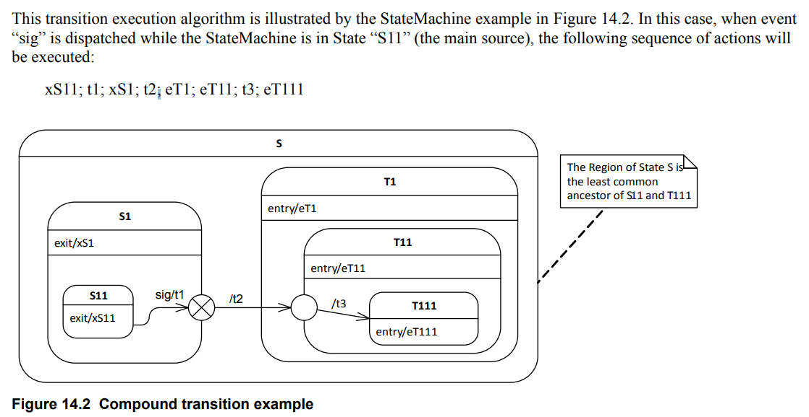

# Finite state machine

- What is a state machine (FSM)?
  - A state machine is a software model of computation, and it comprises finite number states.
  - Since states are finite, there is a finite number of transitions among the states. Transitions are triggered by the input events fed to the state machine (FSM is an event-driven system).
  - A state machine also produces an output. The output produced depends on the current state of the state machine and the input events fed to the state machine.

- Benefits of using state machines (FSMs):
  - 1. Used to describe situations or scenarios of your application (Modelling the life cycle of a reactive object through interconnections of state).
  - 2. FSMs are helpful to model complex applications that involve lots of decision-making, producing different outputs (actions), and processing various events.
  - 3. State machines are visualize through state machine diagrams in the form of state charts, which helps to communicate between non-developers and developers.
  - 4. Makes it easier to visualize and implement the changes to the behavior of the project.
  - 5. Complex application can be visualize as a collection of different states processing a fixed set of events and producing a fixed set of outputs.
  - 6. Loose coupling: An application can be divided into multiple behaviors or state machines, and each unit can be tested separately or could be reused in other applications.
  - 7. Easy debugging and easy code maintenance.
  - 8. Scalable.
  - 9. Narrow down whole application complexity to state level complexity, analyze and implement.

- Different types of state machines:
  - Mealy machines.
  - Moore machines.
  - Harel state charts.
  - UML state machines.

- UML Modelling tool and code generator:
  - Rhapsody by IBM.
  - QM Model-based design tool by Quantum Leaps.
  - Visual State by IAR.
  - Yakinda state chart tools by Itemis AG.

## Mealy and Moore machine

- Mealy machine:
  - In this machine, the output produced by the state machine depends on the input events fed to the state machine AND present active state of the state machine.
  - The output is not produced inside the state UML modelling tool and code generator.

- Generic Mealy model:
  
```text
         ______     _______INPUT/OUTPUT_______     _____
        |     _||_||_                         || ||     |
        |    | State |                       _\/_\/_    |
INPUT/OUTPUT |_______|                      | State |  INPUT/OUTPUT
        |      /\ /\                        |_______|   |
        |______|| ||_______INPUT/OUTPUT_______|| ||_____|
```

- Output is represented along with each input separated by `/`.
- An `Output` is also called `Action`.
- In the mealy model, the `output` is also called `input action`.

- State 1 -> State 2: `INPUT/OUTPUT` also called as a `TRANSACTION`.

- For example:

    ```text

    Initial state
    Light Off
        ||
     ___\/______                               _____
    |  OFF      |-------ON/Dim the light----->| DIM |
    |___________|<------OFF/Light off---------|_____|<--------------|
        /\  /\                                  ||                  |
        ||  ||                              ON/Medium brightness    |
        ||  ||                                  ||                  |
        ||  ||                               ___\/__________        |
        ||  ||----------OFF/Light off-------| Medium bright |       |
        ||                                  |_______________|       |
        ||                                      ||                  |
        ||                                  ON/Full brightness      |
        ||                                      ||                  |
        ||                                   ___\/___               |
        ||--------------OFF/Light off-------| Bright |              |
                                            |________|              |
                                                ||__________________|
                                                ON/Dim the light
    ```

  - When state is off and INPUT = ON -> action is: Dim the light.
  - When state is DIM and INPUT = OFF -> action is: Light off.
  - When state is DIM and INPUT = ON -> action is: Medium brightness.
  - And so on.

- Moore machine
  - In this state machine, the output is determined only by the present active state of the state machine and not by any input events.
  - No output during state transition.
  - Output is represented inside the state.
  - `Output` is also called `Action`.
  - In the Moore model the `Output` is also called `Entry action.`.

```text
     ______     ___________INPUT__________     _____
    |     _||_||_                         || ||     |
    |    | State |                       _\/_\/_    |
  INPUT  |Output_|                      | State |  INPUT
    |      /\ /\                        |Output_|   |
    |______|| ||___________INPUT__________|| ||_____|
```

- For example:

    ```text

    Initial state
    Light Off
        ||
     ___\/______                               _____________
    |  OFF      |-------ON------------------->| DIM         |
    |_Light Off_|<------OFF-------------------|Dim the light|<------|
        /\  /\                                  ||                  |
        ||  ||                                  ON                  |
        ||  ||                                  ||                  |
        ||  ||                               ___\/____________      |
        ||  ||----------OFF-----------------| Medium bright   |     |
        ||                                  |Medium brightness|     |
        ||                                      ||                  |
        ||                                      ON                  |
        ||                                      ||                  |
        ||                                   ___\/__________        |
        ||--------------OFF-----------------| Bright        |       |
                                            |Full brightness|       |
                                                ||__________________|
                                                          ON
    ```

- Input events:
  - ON
  - OFF

- Entry actions:
  - 1. Light off.
  - 2. Dim the light.
  - 3. Make light dim.
  - 4. Make light medium brightness.
  - 5. Make light full brightness.

## Mealy and Moore State Transition Table

- State transition table Light control Mealy machine:

```text
|Present|                       Next state                          |
|state  |-----------------------------------------------------------|
|       |                       Input events                        |
|       |-----------------------------------------------------------|
|       |           OFF              |              ON              |
|       |----------------------------|------------------------------|
|       |Next state  |input action   |Next state |input action      |
|       |            |(output)       |           |(output)          |
|-------|------------|---------------|-----------|------------------|
|Off    |Off         |--ignored--    |Dim        | Make Light Dim   |
|-------|------------|---------------|-----------|------------------|
|Dim    |Off         |Light off      |Medium     | Make light medium|
|-------|------------|---------------|-----------|------------------|
|Medium |Off         |Light off      |Bright     | Make light bright|
|-------|------------|---------------|-----------|------------------|
|Bright |Off         |Light off      |Dim        | Make light dim   |
|-------|------------|---------------|-----------|------------------|
```

- State transition table Light Control Moore machine:

```text
|State  |Entry actions (output) |           Next state          |
|       |                       |-------------------------------|
|       |                       |           Input events        |
|       |                       |-------------------------------|
|       |                       |     OFF      |    ON          |
|       |                       |--------------|----------------|
|-------|-----------------------|--------------|----------------|
|Off    |Light off              |--ignored--   | DIM            |
|Dim    |Make light dim         |Off           | Medium         |
|Medium |Make light medium      |Off           | Bright         |
|Bright |Make light bright      |Off           | Dim            |
```

## Mealy coding exercise

- We handle event from user by using: `Serial.available()` method.
  
```C++

uint8_t current_state = OFF;

void light_state_machine(uint8_t state) {
    switch (current_state) {
        case OFF:
        {
            switch (state) {
                case ON:
                    make_dim_light();
                    current_state = DIM;
                    break;
                case OFF:
                    /* Ignore. */
                break;
            }
        }
        break;
        case DIM:
        {
            
        }
        break;
        case MEDIUM:
        {
            
        }
        break;
        case BRIGHT:
        {
            
        }
        break;
        default:
    }
}

void loop()
{
    uint8_t event;
    if (Serial.available() > 0) {
        event = Serial.read();
        if (event == 'o') {
            light_state_machine(ON);
        } else if (event == 'x') {
            light_state_machine(OFF);
        }
    }
}
```

## UML Flat state machine and implementation

### State machine definition

- What is a state?
  - State represents a distinct stage of an object's lifecycle.
  - A state models a situation in the execution of a StateMachine Behavior during some invariant condition holds. In most cases, this condition is not explicitly defined but is implied, usually through the name associated with the State.

- How do you arrive at fixing a state?
  - Map different scenarios through which an object lifecycle passes into number of states.

- Application -----Set behaviors----> Object
              \----Set attributes------>/

- How to create a state?
  - 1. Draw a round-concerned rectangle.
  - 2. Create a horizontal name compartment.
  - 3. Give a name that is unique within the state machine diagram.

- Types of states in UML:
  - 1. Simple State: If a state doesn't have any sub-states, transitions, regions, sub-machines then it's a simple state.
  - 2. Composite State.
  - 3. Submachine State.

- Composite state:
  - What is a composite state?
    - A state which has sub-states. A composite State contains at least one region.
      - 1. Simple composite state.
      - 2. Orthogonal state.
    - A simple composite state has exactly one region.
  - By using composite states, you can express state hierarchies.
  - It makes state-charts more comprehensible by reducing the number of transitions between sates.

- For example simple state, no regions, no sub states:

```text
 ___________________
|________S0_________|
|                   |
|___________________|
```

- Any state enclosed within a region of a composite state is called a sub-state of that composite state:

```text
 _________________________________________
|_____________________S1__________________|
|    _____________       _____________    |
|   |____S1_0_____|     |____S1_1_____|   |
|   |             |     |             |   |
|   |_____________|     |_____________|   |
|    _____________                        |
|   |____S1_2_____|     Sequential        |
|   |             |     sub-states        |
|   |_____________|                       |
|_R1______________________________________|
```

- S1 is a composite state.
- S1 has 1 region R1.
- S1_x are sub-states of S1.
- S1 is a superstate of S1_x.
- S1_x is very simple states.

- For example, in-direct sub-states:

```text
 _______________________________________________________
|_____________________________S1________________________|
|                                                       |
|                                                       |
|    _____________                                      |
|   |____S1_1_____|                                     |
|   |             |                                     |
|   |_____________|                                     |
|        _________________________________________      |
|       |___________________S1_0__________________|     |
|       |    _____________       _____________    |     |
|       |   |___S1_0_1____|     |___S1_0_0____|   |     |
|       |   |             |     |             |   |     |
|       |   |_____________|     |_____________|   |     |
|       |    _____________                        |     |
|       |   |___S1_0_2____|                       |     |
|       |   |             |                       |     |
|       |   |_____________|                       |     |
|       |_R1______________________________________|     |
|_R1____________________________________________________|
```

- S1_0_1 is in-direct sub-state of S1.
- S1_0 is direct sub-state of S1.

### Demo based on example: Productivity Timer (ProTimer)

- The application that tracks your productive time.

### Astah UML download

- Download link: [link](https://astah.net/)

### Project Requirements

- 1. `+` button -> Increase time (minutes should increase)
- 2. `-` button -> Decrease time (minutes should decrease)
- 3. `S/P` button -> Start/pause the count down; show STAT.
- 4. When the countdown is paused, time can be modified.
- 5. Press the `+` and `-` button simultaneously to abort the running timer.
- 6. Application must beep 20 times when it returns to IDLE mode.
- 7. When the application is in IDLE mode, pressing the `S/P` button should show the STAT for 1 second and auto return to IDLE mode.

- Different scenarios of ProTimer application:
  - IDLE
  - TIME-SET
  - COUNTDOWN
  - PAUSE
  - STAT

- These are the different scenarios which the ProTimer application object lifecycle passes through.

### UML State machine internal state activities (entry/exit/do)

- Internal activities compartment
  - This compartment holds a list of internal behaviors associated with a state.
  - Each entry has following format:
    - `<behavior-type-label>['/'<behavior-expression>]`
  - Example:
    - `entry`, `exit`, `do` are internal activities labels or keywords defined in the UML. Do not use these keywords to represent events in the state machine diagram.

- Internal activity labels
  - These labels identify the circumstances under which the behaviors specified by the `behavior-expression` is executed.
  - 1. *entry*: Behavior identified by `<behavior-expression>` will be executed upon entry to the state. Use the *entry* keyword if the state has entry action.
  - 2. *exit*: Behavior identified by `<behavior-expression>` will be executed upon exit to the state. Use the *exit* keyword if a state has exit action.
  - 3. *do*: Behavior identified by `<behavior-expression>` will be executed as long as the object is in the state or until the computation specified by the expression is completed. This represents ongoing behavior. Use the *do* keyword only if a state has `do` action.

### UML state machine types of transitions

- Internal transition:
  - Each item has the following syntax:
    - `{<trigger>}*['['<guard>']'][/<behavior-expression>]`
    - `{<trigger>}[guard]/action`
    - `event[guard]/action`

  - If the event occurrence matches the `trigger` and `guard` of the internal transition evaluates to be TRUE, then behavior identified by `<behavior-expression>` will be executed without exiting or re-entering the state in which it is defined.

```C
trigger() {
    if (guard) {
        behavior-expression;
    }
}
```

- For example:

    ```text
     ___________________                             _______________________________
    |________STAT_______|                           |________IDLE___________________|
    |                   |---TIME_TICK [e->ss==8]--->|                               |
    |                   |                           |                               |
    |                   |                           |                               |
    |                   |<-------START_PAUSE--------|TIME_TICK [e->ss==8]/do_beep() |
    |                   |                           |                               |
    |___________________|                           |_______________________________|
    ```

  - `TIME_TICK [e->ss==8]/do_beep()` in IDLE state is called as **Internal Transition Compartment**. With:
    - `TIME_TICK` is trigger.
    - `e->ss==5` is guard.
    - `do_beep()` is behavior-expression.
  - The `STAT` state trigger `TIME_TICK [e->ss==8]` event to IDLE state. but `e->ss==8` guard is NOT TRUE so `do_beep()`.
    - `TIME_TICK [e->ss==8]` is called as external transition triggered by STAT state to IDLE state.

- Types of transitions:
  - External.
  - Local.
  - Internal.

- External transition:
  - In external transition, the source state is exited due incident of a trigger, the optional action associated with transition is executed followed by execution of **exit action of the state**.
  - An external transition signifies a change of state or an object's situation in the object's life cycle.
  - When the state is changed, now the object is ready to process a new set of events and execute a new set of actions.
  - Transitions are denoted by lines with arrowheads leading from a source state to a target state.

    ```text
     ___________________                             _______________________________
    |_____COUNTDOWN_____|                           |_____________PAUSE_____________|
    |             Source|---------START_PAUSE------>|Target                         |
    |                   |                           |                               |
    |                   |                           |                               |
    |             Target|<-------START_PAUSE--------|Source                         |
    |                   |                           |                               |
    |___________________|                           |_______________________________|
    ```

    - `START_PAUSE` is just triggered (event), no guard, no action along the transaction.
    - When the current state of the object is `COUNTDOWN` and if the event `START_PAUSE` is received then object transitions to state `PAUSE` (updates its state to `PAUSE`).
      - `COUNTDOWN` is exited and `PAUSE` is entered.

- For example: 
  - The following sequence will be executed:
    - 1. `xS11`: exit of S11 is called first with S11 is sub-state of S1.
    - 2. `t1`: action of `sig` event is called next.
    - 3. `xS1`: exit of S1 state is called. Now we exit of state S1.
    - 4. `t2`: This action is called mean S1 exit and it trigger a event to switch state to T1.
    - 5. `eT1`: entry of T1 is called, now we in T1 state.
    - 6. `eT11`: entry of T11 is called (T11 is sub state of T1).
    - 7. `t3`: is called, this is triggered by t2.
    - 8. `eT111`: entry of T111 is called  (T111 is sub state of T11).

- As you can see: the sequence be executed: (exit sub-state)--->(trigger internal transition to parent-state)--->(exit parent-state)--->(trigger external transition to another state)--->(Entry new state)->(trigger internal transition to sub-state)--->(entry-sub-state)--->(...)
  - We exit from internal to external and entry from external to internal.

- Internal transition:
  - Internal is special case of a local transition that is self-transition(i.e., with the same source and target states), such that the state is never exited (and, thus, not re-entered), which means that no exit or entry behaviors are executed when this transition is executed. This kind of transition can only be defined if the source `Vertex is a State`.

- Local transition:
  - Local is the opposite of external, meaning that the Transition does not exit its containing state (and, hence, the exit Behavior of the containing State will not be executed). However, for local transitions, the target Vertex must be different from its source Vertex. A local Transition can only exist within a composite State.

- **Few points to remember**:
  - `doActivity` behavior commences execution when the state is entered only after the state entry behavior has completed.
  - entry, exit, do, cannot be associated with any transitions.
  - If all transitions into a state perform the same action, push the common action inside the state to make it an entry action.
  - If all transitions leaving a state perform the same action, push the common action inside the state to make it an exit action.

### Events and signals

- Events (Trigger)
- What is an event?
  - Events are incidents or a stimulus by which a state machine can be triggered; incidents are abstracted as events.
  - In state machine events cause transitions (external or internal).

- Incidents in the operation of a microwave oven:
  - 1. Opening door; Heater off, lights on.
  - 2. Closing door; lights off.
  - 3. Set timer; manage time.
  - 4. Start; heater ON.

- Events:
  - An event usually has 2 components:
    - 1. Signal.
    - 2. One or more associated values or parameters (optional).
  - For example:
    - When you click Increase button:
      - event `sig: INC_TIME` this event signifies by its signal attribute that the user has pressed a button which increase the time.
      - The signal doesn't require associated parameters.
    - When you click direction button:
      - event: `sig: TIME_CHANGE` with parameter: `dir Direction_t`.

        ```C
        enum {
            UP,
            DOWN
        } Direction_t;
        ```

      - This event signifies by its signal attribute that the user has pressed a button that changes time.
      - The signal has an associated parameter that encodes whether the user has pressed a button that increases time (UP) or decreases time (DOWN).

  - Another example:
    - when you click your keyboard number, event: `sig: DIGIT_0_9` with parameter: `digit uint8_t`.
